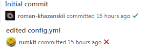
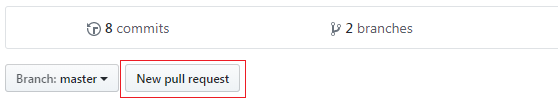
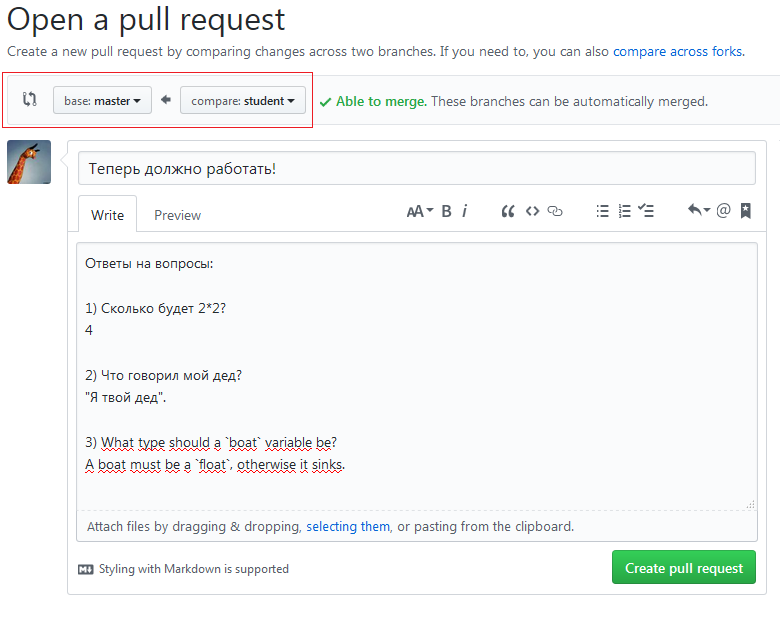
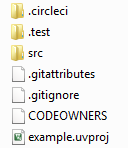

- [Краткое описание курса](#brief)
- [Оценки](#grading)
- [Как сдавать домашние задания](#assignments)
- [Вы заметили ошибку или хотите что-то изменить?](#error-reporting)
- [Описание шаблона проекта](#project-template-description)
- [Как проверяются отступы?](#indentation-check)
  - [Допустимые стили](#possible-styles)
    - [Стиль Java](#java-style)
    - [Стиль Allman](#allman-style)
- [Литература и полезные ссылки](#literature)


<a name="brief"><h1>Краткое описание курса</h1></a>

Официальное название предмета - "Микропроцессоры", но на самом деле мы изучаем программирование микроконтроллеров на примере 32-битного микроконтроллера stm32f103rc на ядре ARM Cortex-M3. 

Код мы пишем в uVision Keil.

В прошлом семестре (который пока что живет на другом ресурсе - вот [тут](http://dl.avalon.ru/course/view.php?id=315)) мы изучали ассемблер, в этом семестре - периферию микроконтроллера.

Презентации и примеры кода к лекциям размещаются в этом репозитории по мере необходимости.

<a name="grading"><h1>Оценки</h1></a>

Оценки выставляются за домашние задания. Каждое задание представляет собой спецификацию к программе, которую нужно реализовать. За каждое задание можно получить 10 баллов; в некоторых заданиях можно получить дополнительные баллы.  
На выполнение каждого задания студенту дается 2 недели, за каждую неделю опоздания снимается 2 балла.  

Несмотря на то, что срок сдачи проверяет скрипт, оценку выставляет преподаватель, поэтому за опоздания в пределах нескольких часов баллы не снимаются.

На выполнение каждого задания дается 3 попытки.

За копирование кода у других студентов выставляется оценка в 0 баллов без права на исправление и выдается индивидуальное задание.

Код с неправильно расставленными отступами не принимается и не оценивается. Список допустимых стилей расстановки отступов с пояснениями находится [здесь](#possible-styles).

<a name="assignments"><h1>Как сдавать домашние задания</h1></a>

При появлении нового задания каждому студенту на почту приходит оповещение следующего вида:
> @roman-khazanskii has invited you to collaborate on the spbstu-microprocessors/assignment_1_student_name repository

Приняв приглашение, студент получает доступ к персональному репозиторию для одного задания. В этом репозитории находится шаблон проекта, структура которого описана [здесь](#project-template-description).

Для выполнения задания студенту нужно клонировать этот репозиторий и переключиться в ветку `student`:  
`git clone <repository-url> -b student`

Теперь студент может писать код и проверять его, делать коммиты и пуши.


Каждый коммит в ветку student будет проверен системой непрерывной интеграции (circleCI); в данный момент проверяются:  
* Дата и время попытки
* Стиль расстановки отступов

В логе гитхаба каждый коммит, прошедший проверку, будет отмечен зеленой галкой; проваливший проверку - красным крестиком:  

  
При желании, студент может посмотреть логи проверки и узнать, что же пошло не так. Для этого необходимо один раз авторизоваться circleCI через github ([ссылка](https://circleci.com/login)); после этого можно кликнуть на галочку или крестик и увидеть лог билда. Если при клике на галочку/крестик вы видите ошибку 404, то вы забыли авторизоваться.

Поскольку скрипты не были проверены слишком тщательно, вероятность ошибочных проверок достаточно велика, поэтому провал/успех проверки не гарантирует ничего со стопроцентной вероятностью; просто так жить немного легче.

Для сдачи задания студенту необходимо сделать pull-request своей ветки в ветку master. Для этого необходимо:
* сделать нужное количество коммитов
* сделать пуш, чтобы ваши коммиты попали на гитхаб
* добиться успешной проверки последнего коммита в системе непрерывной интеграции
* зайти на страницу репозитория и нажать кнопку "Pull request"
  

После нажатия на эту кнопку откроется страница создания пулл-реквеста. На ней нужно выбрать ветки, которые вы хотите слить. Как правило, это будут ветки master и student.  
Пулл-реквест должен быть снабжен осмысленным комментарием. Если это не первый пулл-реквест, то комментарий - отличное место, чтобы ответить на вопросы преподавателя. Настоятельно рекомендуется сохранять текст самого вопроса.

  


Каждый pull-request проверяется преподавателем; отзыв преподавателя размещается в комментариях.  
Если задание принято, то pull-request принимается и в файле `README.md` задания появляется оценка. Если студент не израсходовал 3 попытки исправления и с момента размещения задания не прошло 6 недель, то оценка не является финальной и может быть исправлена.  
Если задание не принято, то pull-request отклоняется.

<a name="error-reporting"><h1>Вы заметили ошибку или хотите что-то изменить?</h1></a>

Если вы заметили ошибку в задании, в презентации, в коде проверочного скрипта и т.д., пожалуйста, создайте [issue](https://github.com/spbstu-microprocessors/lectures/issues).


<a name="project-template-description"><h1>Описание шаблона проекта</h1></a>



Здесь:
* .circleci - папка для системы непрерывной интеграции; содержит:
    *  Dockerfile - файл с описанием образа системы, на которой выполняются тесты.
    *  config.yml - конфиг, в нем написано, какие тесты и когда запускать.
*  .test - папка с тестирующими скриптами. Проверяется дата сдачи и стиль кода.
*  .gitattributes - в этом файле описано, какие символы конца строки нужно использовать. Подробнее об этой проблеме можно почитать [здесь](http://adaptivepatchwork.com/2012/03/01/mind-the-end-of-your-line/).
*  .gitignore - в этом файле перечислено, какие файлы гит будет игнорировать.
*  CODOWNERS - файл, благодаря которому преподаватель получает оповещение о каждом пулл-реквесте.

Все вышеперечисленные файлы и папки рекомендуется не менять, поскольку это сломает оповещение или автоматические проверки. При отправке пулл-реквеста преподавателю видны все изменения во всех файлах :)

*  src - в этой папке должны размещаться все файлы с исходным кодом
*  example.uvproj - файл проекта для среды разработки.

<a name="indentation-check"><h1>Как проверяются отступы?</h1></a>

Найти программы для автоматической проверки стиля кода не удалось, только программы для автоматической *коррекции* стиля. Поэтому проверка осуществляется самым простым способом - с помощью программы `astyle` скрипт генерирует несколько правильных вариантов и последовательно сравнивает исходный вариант с ними.
При обнаружении полного совпадения стиль признается допустимым.
При отсутствии такого совпадения стиль признается недопустимым.

Что же помешает студенту заранее запустить `astyle` и исправить свой стиль?..

<a name="possible-styles"><h2>Допустимые стили</h2></a>

`astyle` поддерживает довольно много стилей, из которого были выбраны стиль "java" и стиль "allman", как самые простые и распространенные; для каждого стиля допускается использование 2 пробелов, 4 пробелов или символа табуляции (но не вперемешку).

<a name="java-style"><h3>Стиль Java</h3></a>
```
if (isAwesome) { <-- обратите внимание на пробел перед фигурной скобкой!
  return true;
}
```

<a name="allman-style"><h3>Стиль Allman</h3></a>
```
if (isAwesome)
{
  return true;
}
```

Если вы хотите, чтобы какой-нибудь другой стиль тоже начал поддерживаться, пожалуйста, создайте [issue](https://github.com/spbstu-microprocessors/lectures/issues).


<a name="literature"><h1>Литература и полезные ссылки</h1></a>

* Мартин М. Инсайдерское руководство по STM32
* http://easyelectronics.ru/category/arm-uchebnyj-kurs
* http://we.easyelectronics.ru/blog/STM32/
* Geoffrey Brown. Discovering the STM32 Microcontroller
* Carmine Noviello. Mastering the STM32 Microcontroller

